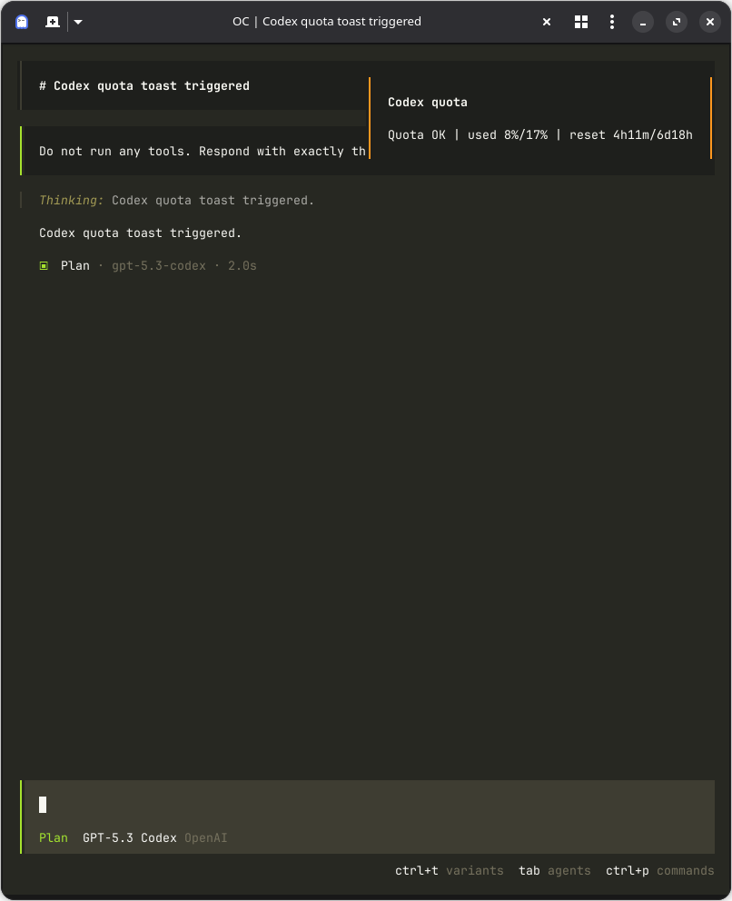

# opencode-codex-usage

Lightweight tooling to surface Codex quota status inside OpenCode so you do not have to keep checking the web usage dashboard.

This is a personal utility that I open-sourced in case it is useful to others.

This project provides:

- a small probe that returns a compact one-line quota summary, and
- an OpenCode TUI plugin that turns that status into in-app toast notifications.

## ✨ What this project does

- Replaces routine web usage dashboard checks with in-app quota visibility.
- Shows quota status in a compact format suitable for CLI and logs.
- Displays OpenCode TUI toast notifications for quota state.
- Supports a low-noise mode where background checks only toast on warning/error states.
- Works across Linux, macOS, and Windows.

## 🗂️ Repository layout

- `codex-quota-probe.ts` - CLI probe entrypoint.
- `codex-quota-toast-plugin.ts` - OpenCode TUI toast plugin.
- `lib/` - shared formatting and path-resolution utilities.
- `tests/` - unit tests for core parsing/formatting logic.
- `dist/` - compiled JavaScript output.

## 🚀 Quick start

1. Install dependencies and build:

```bash
npm install
npm run build
```

2. Run the probe manually:

```bash
node ./dist/codex-quota-probe.js
```

3. Reference the built plugin in your OpenCode config (`plugin` array):

```json
"/absolute/path/to/opencode-codex-usage/dist/codex-quota-toast-plugin.js"
```

Restart OpenCode after plugin changes.

## 📸 Usage screenshot



## 🧠 Behavior in OpenCode

The plugin checks quota on startup and periodically, then decides whether to show a toast.

Default behavior:

- background checks: toast only on warn/critical/error states ⚠️
- explicit quota command trigger: always toast

This keeps normal sessions quiet while still surfacing actionable quota issues.

## ⚙️ Configuration

Auth path is auto-detected by OS:

- Linux: `~/.local/share/opencode/auth.json` (or `$XDG_DATA_HOME/opencode/auth.json`)
- macOS: `~/Library/Application Support/opencode/auth.json`
- Windows: `%LOCALAPPDATA%\\opencode\\auth.json`

Before using this plugin, make sure OpenCode auth has been bootstrapped so that `auth.json` exists.
If you are using Codex auth setup tooling, a common option is:

- `https://github.com/numman-ali/opencode-openai-codex-auth`

Override with:

```bash
OPENCODE_AUTH_PATH=/custom/path/auth.json
```

Troubleshooting:

- If you see `status=ERROR(auth)`, your OpenCode auth file is missing or invalid. Bootstrap auth first (for example via `https://github.com/numman-ali/opencode-openai-codex-auth`), then retry.

## 🛠️ Development

Common commands:

```bash
npm run format
npm run format:check
npm run build
npm test
```

## 📦 Distribution

Build locally:

```bash
npm install
npm run build
```

Auto-configure OpenCode with your local plugin path:

```bash
npm run setup
```

This updates `~/.config/opencode/opencode.jsonc` and adds the built plugin path to the `plugin` array.

If you prefer to configure manually, reference the built plugin from your checkout in OpenCode config:

1. Find your repo's absolute path.

```bash
pwd
```

2. Add the built plugin file to your OpenCode config `plugin` array.

```json
{
  "plugin": ["/absolute/path/to/opencode-codex-usage/dist/codex-quota-toast-plugin.js"]
}
```

3. Replace `/absolute/path/to/opencode-codex-usage` with your real path from `pwd`, then restart OpenCode.

## 📝 Notes

- `dist/` is generated output; edit TypeScript sources in the repo root and `lib/`.
- The probe output format is intentionally compact so it is easy to parse and display.
