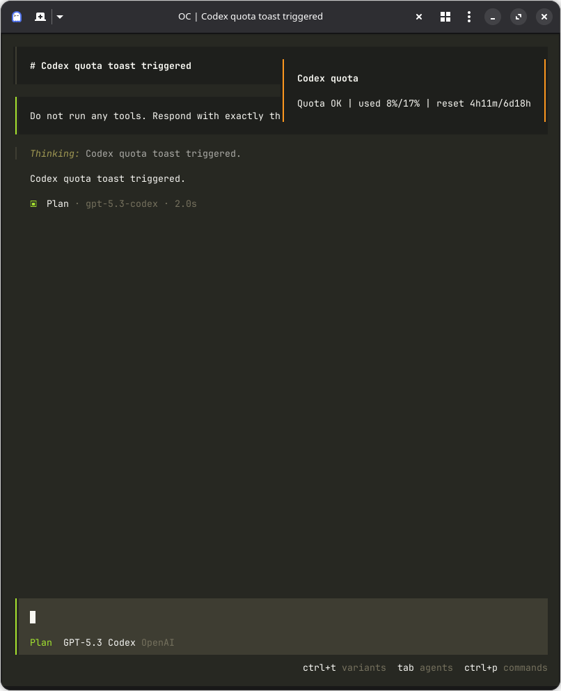

# opencode-codex-usage

Check your Codex quota without leaving OpenCode. Ask the assistant, run `/codex-usage`, or get automatic quota alerts.



## Install

First, use `/connect` in OpenCode to connect your ChatGPT plan through the OpenAI/ChatGPT option. Then:

```bash
npm install -g opencode-codex-usage
opencode-codex-usage --install
```

Restart OpenCode. The installer configures both the server and TUI plugins for **OpenCode 2**.

Global configuration lives in `$XDG_CONFIG_HOME/opencode`, or `~/.config/opencode` by default.
Use `--config <path>` to select a server config; the V2 terminal plugin is always installed in the global `cli.json`.

## Check your usage

**Ask the assistant:**

> How much Codex usage do I have left?
>
> When does my Codex quota reset?

The plugin provides a `codex_usage` tool that the assistant can call to check your connected account's quota and reset times. Questions about “ChatGPT usage” also invoke this check, but the results are **Codex quota**, not general ChatGPT message limits or OpenAI API billing.

**Get a quick toast:**

```text
/codex-usage
```

This checks usage directly, without an assistant turn.

**Automatic alerts:** the plugin checks on startup and every 10 minutes. By default, it only shows a toast when quota status reaches a warning or worse and worsens from the previous check.

## From the terminal

```bash
opencode-codex-usage --pretty  # Readable usage bars
opencode-codex-usage --json    # JSON for scripts
opencode-codex-usage --help    # All options
```

OpenCode 2 terminal queries call the installed server plugin through `opencode api`, using OpenCode's service discovery and authentication. The `opencode` executable must be on `PATH`. Use `--retry 0`, `1`, or `2` to override retries for that query.

## Settings & troubleshooting

Authentication is managed by OpenCode. If you see `provided authorization token is expired`, use `/connect` to reconnect your ChatGPT account.

<details>
<summary>Optional settings</summary>

Set environment variables before starting OpenCode:

| Variable                                 | Default       | Purpose                                                            |
| ---------------------------------------- | ------------- | ------------------------------------------------------------------ |
| `OPENCODE_CODEX_QUOTA_POLL_MS`           | `600000`      | Background check interval in milliseconds                          |
| `OPENCODE_CODEX_QUOTA_TOAST_THRESHOLD`   | `warn`        | Alert threshold: `warn`, `critical`, `error`, `always`, or `never` |
| `OPENCODE_CODEX_QUOTA_TOAST_DURATION_MS` | `5000`        | Toast duration in milliseconds                                     |
| `OPENCODE_CODEX_QUOTA_RETRY_COUNT`       | `1`           | Transient failure retries (`0`–`2`)                                |
| `OPENCODE_CODEX_QUOTA_MODEL`             | Auto-detected | Override the probe model                                           |

For example, to show only critical alerts:

```bash
OPENCODE_CODEX_QUOTA_TOAST_THRESHOLD=critical opencode
```

</details>

<details>
<summary>Upgrade, uninstall, or use OpenCode 1</summary>

To upgrade:

```bash
npm install -g opencode-codex-usage@latest
opencode-codex-usage --install
```

To remove the plugin and package:

```bash
opencode-codex-usage --uninstall
npm uninstall -g opencode-codex-usage
```

Restart OpenCode after changing the installation.

For legacy OpenCode 1, add `--opencode 1` to install, uninstall, or usage queries. V1 queries read `OPENCODE_AUTH_PATH` when set; on macOS and Linux they otherwise use `$XDG_DATA_HOME/opencode/auth.json`, falling back to `~/.local/share/opencode/auth.json`.

If an earlier V2 installer wrote to `~/.config/opencode2`, move its plugin entries to your active global config before removing the old entries.

</details>

## Development

```bash
npm install
npm run build
npm link
opencode-codex-usage --install
```

Restart OpenCode to load the local plugin. Before submitting changes:

```bash
npm test
npm run lint
npm run build
npm run format:check
```
